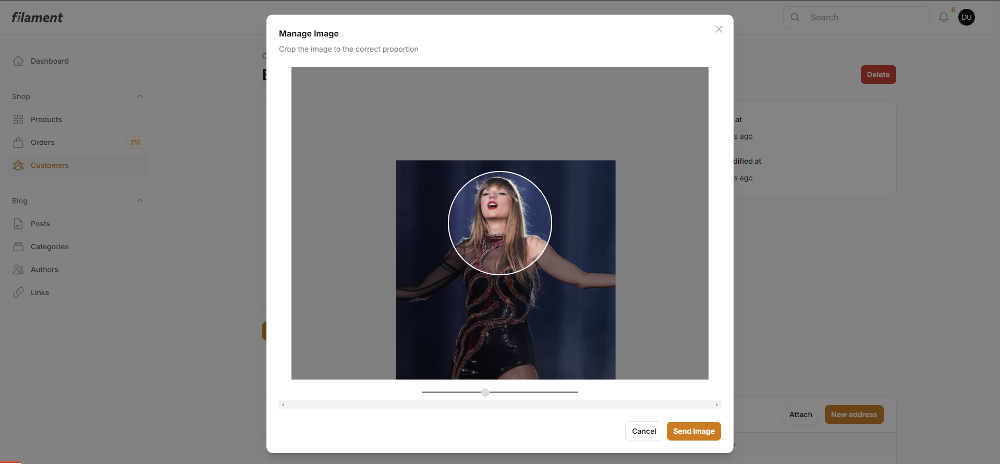
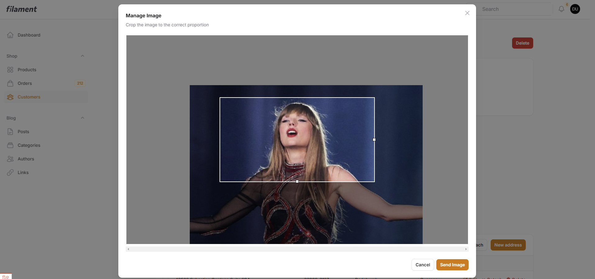

# Filament Croppie - Documentation

[](https://packagist.org/packages/michaeld555/filament-croppie)
[](https://packagist.org/packages/michaeld555/filament-croppie)

This package provides an image cropping component for FilamentPHP, using the Croppie.js library. It allows users to interactively crop images before uploading, offering flexible configuration options to control the crop size, aspect ratio, and format.


## Installation

```bash
composer require michaeld555/filament-croppie
```

After installation, you'll be prompted to publish the configuration file and translations. It's recommended to publish the configuration file to customize the default options.

```bash
php artisan vendor:publish --tag="filament-croppie-config"
```

You can also run the install command to publish the config and translations

```bash
php artisan filament-croppie:install
```

## Configuration

The configuration file `config/filament-croppie.php` allows you to customize the behavior of the Croppie modal. The available options are:

| Option             | Description                                                | Default Value |
|-------------------|------------------------------------------------------------|-------------|
| `title`           | Modal title.                                               | 'Manage Image' |
| `description`    | Modal description.                                            | 'Crop the image to the correct proportion' |
| `icon`            | Modal icon (optional).                                        | `null`       |
| `size`            | Modal size (e.g., `sm`, `md`, `lg`, `xl`, `2xl`, `3xl`, `4xl`, etc.). | `4xl`       |
| `boundary-height` | Height of the crop boundary area.                            | `400`       |
| `boundary-width`  | Width of the crop boundary area.                             | `600`       |
| `viewport-height` | Height of the visible crop area (viewport).                 | `200`       |
| `viewport-width`  | Width of the visible crop area (viewport).                  | `200`       |
| `enable-resize`   | Enables resizing of the viewport.                           | `false`      |
| `enable-zoom`    | Enables zooming on the image.                               | `true`       |
| `show-zoomer`     | Shows the zoom control.                                     | `true`       |
| `viewport-type`   | Type of viewport (`circle` or `square`).                    | `circle`     |


## Usage

To use the Croppie component in a Filament form, simply instantiate the `Michaeld555\FilamentCroppie\Components\Croppie` component:

```php
use Michaeld555\FilamentCroppie\Components\Croppie;

Croppie::make('avatar')
    ->label('Avatar') // Field label
    ->disk('public') // Storage disk
    ->directory('avatars') // Storage directory
    // ... other configuration options
```

### Examples

#### Basic Usage with Custom Upload Path

```php
Croppie::make('profile_picture')
    ->label('Profile Picture')
    ->disk('s3')
    ->directory('profile-images')
    ->imageResizeTargetWidth(400)
    ->imageResizeTargetHeight(400);
```

#### Circular Crop (Avatar) with Larger Modal

```php
Croppie::make('user_avatar')
    ->avatar()
    ->modalSize('5xl')
    ->modalDescription('Please upload a square image for optimal results.');
```



#### Square Crop with Custom Viewport Size and Zoom Disabled

```php
Croppie::make('product_image')
    ->viewportType('square')
    ->viewportHeight(250)
    ->viewportWidth(250)
    ->enableZoom(false)
    ->imageFormat('webp');
```



### Croppie Component Methods

* **`modalTitle(string | Closure | null $modalTitle)`**: Sets the modal title.
* **`modalDescription(string | Closure | null $modalDescription)`**: Sets the modal description.
* **`modalIcon(string | Closure | null $modalIcon)`**: Sets the modal icon.
* **`modalSize(string | Closure | null $modalSize)`**: Sets the modal size.
* **`customClasses(string | Closure | null $customClasses)`**: Sets custom CSS classes for the Croppie container.
* **`enableOrientation(bool | Closure | null $enableOrientation)`**: Enables/disables image orientation detection.
* **`enableResize(bool | Closure | null $enableResize)`**: Enables/disables viewport resizing.
* **`enableZoom(bool | Closure | null $enableZoom)`**: Enables/disables zoom on the image.
* **`enforceBoundary(bool | Closure | null $enforceBoundary)`**:  Sets whether the image should be forced to stay within the defined boundary.
* **`mouseWheelZoom(bool | Closure | string $mouseWheelZoom)`**: Sets the mouse wheel zoom behavior (`true`, `false`, or `'ctrl'`).
* **`showZoomer(bool | Closure | null $showZoomer)`**: Sets whether the zoom control should be displayed.
* **`forceCircleResult(bool | Closure | null $forceCircleResult)`**: Sets whether the crop result should be forced to a circle.
* **`viewportType(string | Closure | null $viewportType)`**: Sets the viewport type (`'circle'` or `'square'`).
* **`viewportHeight(string | Closure | null $viewportHeight)`**: Sets the viewport height.
* **`viewportWidth(string | Closure | null $viewportWidth)`**: Sets the viewport width.
* **`boundaryHeight(string | Closure | null $boundaryHeight)`**: Sets the boundary height.
* **`boundaryWidth(string | Closure | null $boundaryWidth)`**: Sets the boundary width.
* **`imageFormat(string | Closure | null $imageFormat)`**: Sets the resulting image format (e.g., 'png', 'jpeg', 'webp').
* **`imageSize(string | Closure | null $imageSize)`**: Sets the resulting image size (`'viewport'` or `'original'`).
* **`imageName(string | Closure | null $imageName)`**:  Allows customizing the image name. By default, a UUID is used.

## Changelog

Please see [CHANGELOG](CHANGELOG.md) for more information on what has changed recently.

## Credits

-   [Michael Douglas](https://github.com/michaeld555)
-   [All Contributors](../../contributors)

## License

The MIT License (MIT). Please see [License File](LICENSE.md) for more information.

